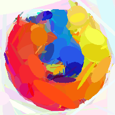
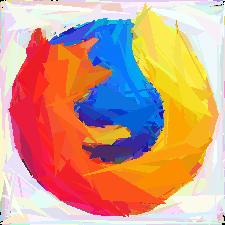
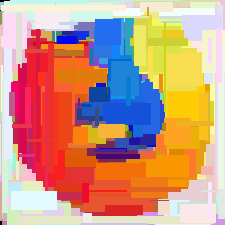

# Image Decomposer python

better version: [here](https://github.com/georgerapeanu/ImageDecomposerC)

## What is this ?

Python program that takes in images and reconstructs them from primitive geometrical elements using the Monte Carlo approach. 

## Examples

* firefox 
* firefox 
* firefox 
* firefox 
* firefox 
* firefox 

## Features

The following modes are currently supported:

* `e` Ellipse
* `c` Circle
* `t` Triangle
* `r` rectangle (orthogonal)
* `q` square (with rotation)

## Usage

`./monteCarlo.py [m] [image_path]`

you can view the progress in your browser on localhost
Sharing real-time decomposition can be done by port-forwarding

The images are automatically saved after a certain number of generations (`1000` by default)
an SVG file will also be generated alongside the raster. This is view-able in the browser as well and gets saved when quitting the program or when the target number of generations is reached.

**Notice:**the SVG file generation is the only reason you should use this over the newer C++ version, as it is the only feature not currently supported there.

## How it works ?

The working principle is really simple
It has a custom distance function that compares two images and returns a value (the higher it is, the more "different" the images are)
The program takes in the input image, creates a blank image of the same resolution and then runs a number of **Attempts** consisting of random guesses for the geometric primitive entity and after completing the specified number of attempts it simply keeps whichever one yields the smallest distance when compared to the original image. This is called a Generation. After a reasonably large number of generations the image will start to look more and more like the provided image. 

## Considerations

***DO NOT USE IMAGES WITH RESOLUTION LARGER THAN 400x400 pixels***, as it will be unusably slow ... the recommended resolution is somewhere between 100 and 250 pixels

Note that after a point, the speed at which the decomposed image approaches the target image will grind to a halt ... i.e. anything above 100000 generations is (in most cases) a waste of time and CPU power
Speaking of CPU power, this program is not exactly efficient. 
There is another version which runs faster( as it is written in `cpp`), which you can find [here](https://github.com/georgerapeanu/ImageDecomposerC)
